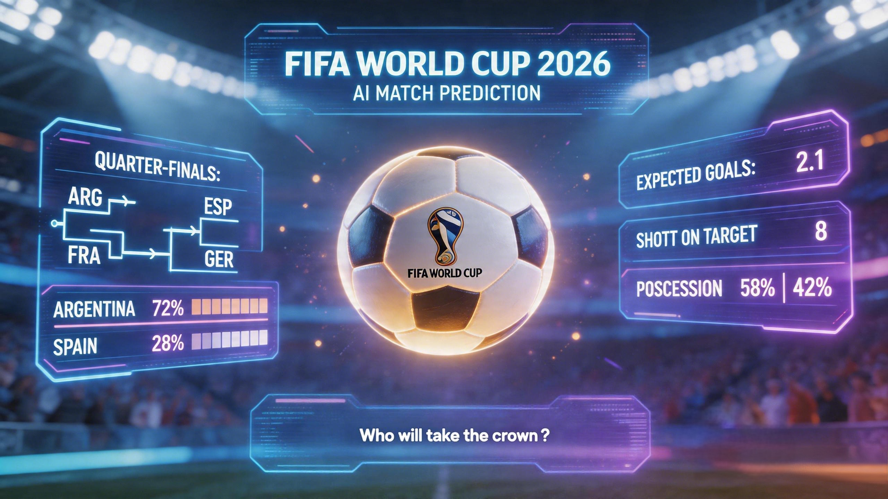

# WorldCupPredictor



> 2026 年世界杯智能比分预测平台

---

## 项目背景

2026 年世界杯将由加拿大、墨西哥、美国联合主办，参赛球队扩军至 48 支，赛制也迎来重大变革。面对更加复杂的小组赛和淘汰赛制，球迷们需要更智能的工具来跟踪赛程和获取专业的比赛分析。

本项目是一个基于 AI 大模型的 **世界杯比分预测智能体**，通过实时获取官方赛程数据，结合球队历史战绩、排名、球员状态等多维度信息，为每一场比赛提供智能预测分析。

---

## 功能特性

### 核心功能

| 功能 | 描述 |
|------|------|
| **实时赛程** | 从 FIFA 官方数据源获取最新赛程和比分信息 |
| **AI 比分预测** | 基于大语言模型的智能比分预测，附带置信度分析 |
| **历史交锋** | 展示两支球队的历史对战记录 |
| **球队状态** | FIFA 排名、近期战绩、关键球员伤停信息 |
| **自动刷新** | 支持手动触发和定时自动数据更新 |
| **预测评估** | 对已结束比赛进行预测准确率评估 |

### 技术亮点

- **数据驱动**：直接对接 FIFA 官方数据源，确保信息准确性
- **AI 增强**：利用 LLM 进行非结构化数据的结构化提取和智能预测
- **增量更新**：支持基线导入和增量刷新两种模式
- **可观测性**：完整的同步运行记录和解析结果审计

---

## 技术架构

### 后端框架

```
FastAPI 0.115.0          # 现代异步 Web 框架
├── SQLAlchemy 2.0.36    # ORM 数据库操作
├── Uvicorn 0.32.0       # ASGI 服务器
├── httpx 0.27.2         # 异步 HTTP 客户端
├── Alembic 1.14.0       # 数据库迁移工具
└── Pydantic             # 数据验证
```

### AI 集成

- **OpenRouter API**：统一的 LLM 接入层
- 支持 Web 搜索插件和响应修复
- 配置化的模型切换能力

### 数据流程

```
┌─────────────┐     ┌─────────────┐     ┌─────────────┐
│ FIFA 官网   │────▶│  数据抓取   │────▶│  LLM 解析   │
│ (数据源)    │     │  (Fetcher)  │     │  (Parser)   │
└─────────────┘     └─────────────┘     └──────┬──────┘
                                                  │
                                                  ▼
                                          ┌─────────────┐
                                          │  数据规范化 │
                                          │  (Normalize)│
                                          └──────┬──────┘
                                                  │
                                                  ▼
                                          ┌─────────────┐
                                          │  SQLite DB  │
                                          └─────────────┘
```

---

## 项目结构

```
WorldCupPredictor/
├── backend/                    # 后端服务
│   ├── api/                    # API 路由层
│   │   ├── health.py           # 健康检查
│   │   ├── matches.py          # 比赛数据接口
│   │   ├── refresh.py          # 数据刷新接口
│   │   ├── predict.py          # AI 预测接口
│   │   └── ...
│   ├── core/                   # 核心配置
│   ├── database/               # 数据库会话管理
│   ├── evaluation/             # 预测评估模块
│   ├── llm/                    # LLM 客户端封装
│   ├── models/                 # SQLAlchemy 数据模型
│   ├── repositories/           # 数据访问层
│   ├── services/               # 业务逻辑层
│   │   ├── refresh.py          # 数据刷新核心逻辑
│   │   ├── predictions.py      # 预测服务
│   │   └── seed.py             # 种子数据加载
│   ├── data/                   # 数据存储
│   │   ├── fixtures/           # 种子数据
│   │   └── cache/              # 预测缓存
│   ├── config/                 # 配置文件
│   ├── tests/                  # 测试用例
│   ├── requirements.txt        # Python 依赖
│   └── main.py                 # 应用入口
│
├── frontend/                   # 前端资源（规划中）
│   ├── index.html              # 主页面
│   ├── css/                    # 样式文件
│   └── js/                     # 脚本文件
│
├── assets/                     # 静态资源
│   └── WorldCupPredictor.jpg   # 项目封面图
│
├── docs/                       # 文档
│   └── superpowers/specs/      # 设计文档
│
├── .gitignore                  # Git 忽略配置
└── README.md                   # 项目说明（本文件）
```

---

## 快速开始

### 环境要求

- Python 3.11+
- SQLite 3

### 安装步骤

1. **克隆仓库**
   ```bash
   git clone https://github.com/HXY-12345/WorldCupPredictor.git
   cd WorldCupPredictor
   ```

2. **创建虚拟环境**
   ```bash
   cd backend
   python -m venv venv
   
   # Windows
   venv\Scripts\activate
   
   # macOS/Linux
   source venv/bin/activate
   ```

3. **安装依赖**
   ```bash
   pip install -r requirements.txt
   ```

4. **配置环境变量**
   
   创建 `.env` 文件（可选）：
   ```env
   DATABASE_URL=sqlite:///./data/matches.db
   ENABLE_FIXTURE_SEED=true
   FIXTURE_SEED_PATH=backend/data/fixtures/official_schedule.json
   ```

5. **启动服务**
   ```bash
   uvicorn main:app --reload --port 8000
   ```

6. **访问 API**
   - API 文档：http://localhost:8000/docs
   - 健康检查：http://localhost:8000/api/health

### Docker 部署（可选）

```bash
# 构建镜像
docker build -t worldcup-predictor .

# 运行容器
docker run -p 8000:8000 worldcup-predictor
```

---

## API 端点

| 端点 | 方法 | 描述 |
|------|------|------|
| `/api/health` | GET | 健康检查 |
| `/api/matches` | GET | 获取所有比赛 |
| `/api/matches/{id}` | GET | 获取单场比赛 |
| `/api/refresh` | POST | 触发数据刷新 |
| `/api/predict/{id}` | POST | 触发 AI 预测 |
| `/api/sync-runs` | GET | 获取同步记录 |
| `/api/evaluations` | GET | 获取预测评估 |

详细 API 文档请访问 `/docs` 端点。

---

## 配置说明

### OpenRouter 配置

项目使用 OpenRouter 作为 LLM 提供商，需要配置：

1. 创建配置文件 `backend/config/openrouter.key`:
   ```
   sk-or-v1-xxxxx...
   ```

2. 创建模型配置 `backend/config/openriver.model.json`:
   ```json
   {
     "model": "anthropic/claude-3.5-sonnet",
     "enable_web_plugin": true,
     "enable_response_healing": true
   }
   ```

### 数据源配置

在 `backend/core/config.py` 中配置 FIFA 官方数据源 URL。

---

## 开发指南

### 运行测试

```bash
pytest backend/tests/
```

### 数据库迁移

```bash
# 生成迁移脚本
alembic revision --autogenerate -m "description"

# 执行迁移
alembic upgrade head
```

### TDD 开发

项目内置 test-driven-development skill，推荐按 TDD 流程开发：

1. 先写测试（Red）
2. 编写代码通过测试（Green）
3. 重构优化（Refactor）

---

## 路线图

- [x] 基础 API 框架
- [x] 数据刷新机制
- [x] AI 比分预测
- [x] 预测评估系统
- [ ] 前端界面开发
- [ ] 实时比分推送
- [ ] 用户认证系统
- [ ] 预测历史记录
- [ ] 多语言支持

---

## 许可证

MIT License

Copyright (c) 2026 HXY-12345

Permission is hereby granted, free of charge, to any person obtaining a copy
of this software and associated documentation files (the "Software"), to deal
in the Software without restriction, including without limitation the rights
to use, copy, modify, merge, publish, distribute, sublicense, and/or sell
copies of the Software, and to permit persons to whom the Software is
furnished to do so, subject to the following conditions:

The above copyright notice and this permission notice shall be included in all
copies or substantial portions of the Software.

THE SOFTWARE IS PROVIDED "AS IS", WITHOUT WARRANTY OF ANY KIND, EXPRESS OR
IMPLIED, INCLUDING BUT NOT LIMITED TO THE WARRANTIES OF MERCHANTABILITY,
FITNESS FOR A PARTICULAR PURPOSE AND NONINFRINGEMENT. IN NO EVENT SHALL THE
AUTHORS OR COPYRIGHT HOLDERS BE LIABLE FOR ANY CLAIM, DAMAGES OR OTHER
LIABILITY, WHETHER IN AN ACTION OF CONTRACT, TORT OR OTHERWISE, ARISING FROM,
OUT OF OR IN CONNECTION WITH THE SOFTWARE OR THE USE OR OTHER DEALINGS IN THE
SOFTWARE.

---

## 贡献

欢迎提交 Issue 和 Pull Request！

## 联系方式

- 项目主页：https://github.com/HXY-12345/WorldCupPredictor
- 问题反馈：https://github.com/HXY-12345/WorldCupPredictor/issues
